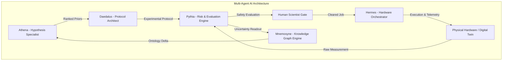

# HELIX — Closed-Loop Autonomous Discovery OS
## Enterprise Executive Briefing & Platform Overview

---

## Executive Summary

**HELIX** is a next-generation **Closed-Loop Discovery Operating System** designed to accelerate scientific, pharmaceutical, and industrial research and development. Unlike traditional static AI chatbots or passive Laboratory Information Management Systems (LIMS), HELIX operates a **continuous autonomous cycle**: generating hypotheses, designing targeted experiments, scheduling physical lab robotics and digital twins, enforcing scientist-in-the-loop safety gates, and compounding enterprise knowledge into a dynamic ontology.

By shifting from open-loop observation to closed-loop physical execution, HELIX compresses R&D discovery timelines from years to weeks, eliminates costly dead-end experimental paths through aggressive upfront falsification, and builds an immutable, audit-ready cryptographic ledger of every scientific decision.

```
       ┌─────────────────────────────────────────────────────────────┐
       │                  THE HELIX DISCOVERY LOOP                   │
       └─────────────────────────────────────────────────────────────┘
          
            ┌──────────────┐         ┌──────────────────┐
            │  1. INGEST   │ ──────> │  2. HYPOTHESIZE  │
            │   (Hermes)   │         │     (Athena)     │
            └──────────────┘         └──────────────────┘
                   ▲                          │
                   │                          ▼
            ┌──────────────┐         ┌──────────────────┐
            │  8. UPDATE   │         │    3. DESIGN     │
            │ (Mnemosyne)  │         │    (Daedalus)    │
            └──────────────┘         └──────────────────┘
                   ▲                          │
                   │                          ▼
            ┌──────────────┐         ┌──────────────────┐
            │  7. MEASURE  │         │ 4. SCIENTIST GATE│
            │   (Pythia)   │         │     (Human)      │
            └──────────────┘         └──────────────────┘
                   ▲                          │
                   │                          ▼
            ┌──────────────┐         ┌──────────────────┐
            │    6. RUN    │ <────── │     5. QUEUE     │
            │ (Instrument) │         │     (Hermes)     │
            └──────────────┘         └──────────────────┘
```

---

## 1. Core Architecture: The 8-Stage Autonomous Loop

HELIX automates scientific discovery through an 8-stage closed-loop workflow:

| Stage | Name | Responsible Agent | Primary Function |
| :--- | :--- | :--- | :--- |
| **1** | **Ingest** | `Hermes` | Aggregates enterprise data streams, literature graphs, and recent cycle posteriors. |
| **2** | **Hypothesize** | `Athena` | Generates uncertainty-aware candidate hypotheses with explicit causal mechanisms and kill criteria. |
| **3** | **Design** | `Daedalus` | Compiles detailed experimental protocols, blind controls, hardware requirements, and cost envelopes. |
| **4** | **Approve** | `Pythia / Human` | Scientist-in-the-loop gate. Enforces mandatory human approval for high-risk protocols while auto-clearing low-risk runs. |
| **5** | **Queue** | `Hermes` | Schedules hardware slots across robotic liquid handlers, additive manufacturing testbeds, and edge sensor networks. |
| **6** | **Run** | `Instrument` | Executes physical runs or high-fidelity digital twin simulations. |
| **7** | **Measure** | `Pythia` | Ingests sensor readouts, calculates delta vs. baseline, and quantifies 95% confidence intervals. |
| **8** | **Update** | `Mnemosyne` | Modifies the enterprise Knowledge Graph, retires invalidated mechanisms, and updates model calibration. |

---

## 2. Multi-Agent AI System Architecture

HELIX deploys a team of specialized, role-bound AI agents that collaborate across each cycle iteration:



### Key Agent Profiles

1. **Athena (Hypothesis & Bayesian Priors Specialist)**
   - Formulates uncertainty-aware hypotheses from literature and prior cycle results.
   - Calculates Bayesian prior probability $P(H)$ and initial epistemic uncertainty $\sigma_H$.
   - Enforces **falsifiers-first**: every hypothesis requires a pre-registered kill criterion.

2. **Daedalus (Design of Experiments - DOE Architect)**
   - Translates abstract hypotheses into concrete, machine-executable laboratory protocols.
   - Configures controls ($n=6$, negative controls, sham treatments, calibration standards).
   - Estimates execution duration, material cost envelope, and hardware routing.

3. **Pythia (Risk Gatekeeper & Bayesian Evaluator)**
   - Evaluates protocol risk profiles (`low`, `medium`, `high`).
   - Pauses execution and alerts lead scientists when high-stakes parameters or bio/chemical hazards are detected.
   - Analyzes instrument readouts and evaluates posterior mass shifts.

4. **Hermes (Hardware Orchestrator & Telemetry Streamer)**
   - Interfaces directly with lab robotics, LPBF printers, microfluidic chips, and edge sensors.
   - Manages queue placement and streams real-time equipment telemetry back to the control room.

5. **Mnemosyne (Knowledge Graph & Epistemic Memory Engine)**
   - Maintains the enterprise ontology graph connecting entities, properties, mechanisms, constraints, and measurements.
   - Writes immutable graph deltas after each cycle iteration to prevent recurring failures.

---

## 3. Supported Industry Domains & Pre-Configured Campaigns

HELIX includes out-of-the-box support for five major industrial discovery domains:

```
┌─────────────────────────────────────────────────────────────────────────────┐
│                       HELIX INDUSTRIAL VERTICALS                            │
├───────────────────┬───────────────────┬───────────────────┬─────────────────┤
│ ENERGY STORAGE    │ DRUG DISCOVERY    │ MANUFACTURING     │ AGRICULTURE     │
│ Solid Electrolyte │ Allosteric SAR    │ LPBF Print Window │ Nitrogen Use    │
│ Conductivity      │ Isoform Select.   │ Porosity / Stress │ Inocula Sync    │
└───────────────────┴───────────────────┴───────────────────┴─────────────────┘
```

### Pre-Configured Discovery Campaigns
1. **Energy Storage (Li-Metal Solid Electrolytes)**
   - *Target Question:* Raising room-temperature ionic conductivity above $12\text{ mS/cm}$ without dendrite breakthrough at $2\text{ mA/cm}^2$.
   - *Hardware:* Autonomous Robotic Electrolyte Foundry (Bay 4).
2. **Drug Discovery (JAK2 Allosteric Series)**
   - *Target Question:* C-helix pocket occupancy for $>40\times$ JAK2/JAK1 selectivity without triggering hERG liability.
   - *Hardware:* High-Throughput Screening (HTS) Surface Plasmon Resonance (Rack C).
3. **Advanced Manufacturing (Ti-6Al-4V LPBF Process Window)**
   - *Target Question:* Scan strategies to suppress keyhole porosity below $0.2\%$ while maintaining residual stress under $180\text{ MPa}$.
   - *Hardware:* Laser Powder Bed Fusion (LPBF) Testbed (Line 2).
4. **Sustainable Agriculture (Wheat Nitrogen-Use Loop)**
   - *Target Question:* Rhizosphere inocula plus deficit irrigation to boost nitrogen-use efficiency by $18\%$ without grain-protein collapse.
   - *Hardware:* Phenotyping Greenhouse Edge-Sensor Network (Block N).
5. **Materials Science & Catalysis (Fe–N–C Oxygen Reduction)**
   - *Target Question:* Microporous active site geometry to maximize ammonia Faradaic efficiency while excluding $O_2$ oxidation.
   - *Hardware:* Autonomous Micro-Flow Reactor & Digital Twin.

---

## 4. Key Platform Modules & User Capabilities

### 1. Control Room Dashboard
- **Interactive Stage Loop Ring:** Visualizes real-time cycle status, waiting gates, and active stage execution.
- **Hypothesis Board:** Ranked candidate hypotheses showing prior probabilities, uncertainty ranges, causal mechanisms, and falsifiers.
- **Scientist Gate Panel:** One-click approval (`Approve & queue`) or rejection (`Reject & re-hypothesize`) with policy toggles for low-risk auto-clearing.

### 2. Hardware Telemetry & Sensor Monitor
- **Live Equipment Status:** Telemetry status indicator showing online state, site designation, queue position, and duration.
- **Real-Time Sensor Streams:** Interactive SVG sparkline and area charts displaying live instrument feeds (e.g. impedance sweeps, HPLC peak curves, thermal melt-pool traces).

### 3. Convergence & Epistemic Analytics
- **Knowledge Gain Curve:** Tracks cumulative enterprise knowledge gain percentage over cycle iterations.
- **Model vs. Reality Calibration:** Visualizes how closely surrogate predictive models align with empirical physical measurements over time.

### 4. Cryptographic Provenance Ledger
- **Append-Only Audit Log:** Every action, protocol, hypothesis, scientist signature, and result is stamped with an immutable SHA-256 hash.
- **Audit-Ready Export:** One-click export of complete campaign provenance logs as signed CSV/JSON files for regulatory compliance (FDA IRB, ISO 17025, IP patent filings).

### 5. Custom Campaign & Hypothesis Builder
- **New Campaign Creator:** Define bespoke scientific questions, set target domains, assign lead scientists, and initialize custom discovery loops.
- **Propose Hypothesis Modal:** Allows human researchers to manually inject novel hypotheses into Athena’s Bayesian agent pool.

---

## 5. Enterprise Security, Governance & Regulatory Compliance

HELIX is built from the ground up for high-stakes corporate R&D environments:

* **Scientist-in-the-Loop Safeguards:** Irreversible physical actions, hazardous chemical syntheses, or high-cost protocols automatically escalate to human approval gates.
* **Deterministic Governance:** Policies can be enforced globally (e.g., auto-approve low-risk runs, force manual sign-off on pharma in-vivo trials).
* **IP & Provenance Security:** Immutable cryptographic hashing ensures unambiguous proof of discovery priority for patent prosecution and regulatory filings.
* **Air-Gapped Integration:** HELIX connects via secure REST/gRPC endpoints to legacy LIMS, ELNs, and automated lab hardware without requiring public internet access to sensitive IP.

---

## 6. Business Value & ROI Metrics

| R&D Metric | Traditional Open-Loop R&D | HELIX Autonomous OS | Enterprise Impact |
| :--- | :--- | :--- | :--- |
| **Cycle Iteration Time** | 3–6 Months per cycle | 8–24 Hours per cycle | **>90% Reduction in time-to-result** |
| **Dead-End Research Cost** | $500k–$2M per dead branch | Filtered at Stage 2 (Falsifiers) | **Eliminates wasted lab reagents & machine time** |
| **Knowledge Retention** | Static PDFs & siloed lab notes | Compounding Knowledge Graph | **Enterprise IP compounding asset** |
| **Auditability** | Manual retrospective log assembly | Real-time Cryptographic Ledger | **Zero-effort regulatory compliance** |

---

> **Summary:** HELIX turns science into a compounding asset. By coupling AI multi-agent reasoning directly with physical lab execution and human oversight, HELIX delivers faster, safer, and verifiable scientific breakthroughs.
